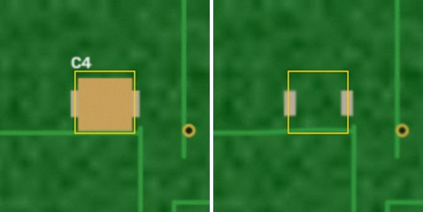

# PCB Inspection Service

[](https://github.com/Cheburek28/PCBInspectionService/actions/workflows/ci.yml)
[](https://github.com/Cheburek28/PCBInspectionService/actions/workflows/security.yml)
[](LICENSE)

Automated optical inspection as a small HTTP service: send a **reference photo** of a known-good
printed circuit board and photos of the **boards under test**. The service aligns every photo to the
reference, returns the regions that differ, rejects unusable photos (blurry, wrong board, bad lighting)
and records the operator's decision on every region — building a labelled dataset for training a model later.

```
reference.jpg ─┐                         ┌─ differences: [{bbox_test, bbox_ref, score}, …]
               ├─► align ─► compare ─────┤
photo.jpg ─────┘   (SIFT, ECC, flow)     └─ or rejection: IMAGE_BLURRY | ALIGNMENT_FAILED | …

operator: accept / reject each difference, mark missed regions ─► PostgreSQL ─► COCO dataset export
```

| Reference (left) vs board under test (right), as returned by `GET …/crop?kind=pair` |
|:--:|
|  |

## Features

- **Async HTTP API** (FastAPI): `202 Accepted` + long-polling, idempotent submissions, RFC 9457 errors,
  OpenAPI contract in [`openapi.json`](openapi.json).
- **Classic computer vision engine** (`classic-diff`): SIFT + RANSAC homography, ECC refinement, smoothed
  optical flow, colour normalisation, misregistration-tolerant Lab difference. Pluggable — an ML engine
  can be registered next to it.
- **Quality gates**: alignment, sharpness, lighting, "too many differences" — the client is told *why*
  a photo cannot be judged.
- **Feedback loop**: per-region verdicts with full history, manual regions mapped into reference
  coordinates, board-level verdicts, COCO export with precision/recall of the algorithm.
- **Ops**: one Docker image (api / worker / migrate / cli), Celery + Redis workers, PostgreSQL,
  local or S3 storage, Prometheus metrics, JSON logs, Caddy TLS for production.

## Quick start

```bash
git clone https://github.com/Cheburek28/PCBInspectionService && cd PCBInspectionService
docker compose up -d --build --wait          # api on :8000, worker, postgres, redis
docker compose exec api pcbis apikey create --station demo   # prints the API key
```

Open http://localhost:8000/docs, or use curl:

```bash
KEY=pcbis_...                                 # from the command above
API=http://localhost:8000/api/v1
SID=$(curl -s -H "Authorization: Bearer $KEY" -H 'Content-Type: application/json' \
      -d '{"product_code":"demo-board"}' $API/sessions | jq -r .id)

curl -s -H "Authorization: Bearer $KEY" -F side=1 -F image=@reference.jpg $API/sessions/$SID/references

IID=$(curl -s -H "Authorization: Bearer $KEY" -H "Idempotency-Key: $(uuidgen)" \
      -F side=1 -F 'board={"board_key":"board-0001"}' -F image=@photo.jpg \
      $API/sessions/$SID/inspections | jq -r .id)

curl -s -H "Authorization: Bearer $KEY" "$API/inspections/$IID?wait=20" | jq '.status, .defects'
```

No board photos at hand? `uv run python scripts/smoke.py` generates synthetic boards and runs the whole flow.

## How a client uses it

1. `POST /sessions` — one session per batch of identical boards.
2. `POST /sessions/{id}/references` — reference photo per board side (or promote any inspected photo
   with `…/references/from-inspection`).
3. `POST /sessions/{id}/inspections` — photo of one side of one board → `202` with `poll_url`.
4. `GET /inspections/{id}?wait=20` — `completed` with `defects`, `rejected` with a reason, or `failed`.
5. `PUT /defects/{id}/verdict`, `POST /inspections/{id}/defects`, `PUT /sessions/{id}/boards/{key}/verdict`
   — operator feedback.

Coordinates are pixels of the uploaded image after EXIF orientation. Details: [docs/api.md](docs/api.md).

## Documentation

| | |
|---|---|
| [docs/api.md](docs/api.md) | Client guide: flow, coordinates, idempotency, polling, examples |
| [docs/errors.md](docs/errors.md) | Every error and rejection code |
| [docs/algorithm.md](docs/algorithm.md) | How `classic-diff` works, parameters, limitations, calibration |
| [docs/dataset.md](docs/dataset.md) | What is stored, export format, TP/FP/FN semantics |
| [docs/configuration.md](docs/configuration.md) | All `PCBIS_*` settings |
| [docs/deployment.md](docs/deployment.md) | Production on a single VPS with TLS and backups |
| [docs/runbook.md](docs/runbook.md) | Operations: health, metrics, common incidents |
| [docs/architecture.md](docs/architecture.md) | Components, layers, data model |
| [docs/adr/](docs/adr/) | Architecture decision records |
| [AGENTS.md](AGENTS.md) | Working on the code (humans and AI agents) |

## Development

```bash
make install      # uv sync + pre-commit hooks
make check        # lint, mypy --strict, architecture contracts, tests with coverage gate (needs Docker)
make up && make smoke
```

See [CONTRIBUTING.md](CONTRIBUTING.md).

## Limitations

- One reference per side: normal variation between good boards (solder sheen, via colour, labels) may
  show up as differences. Calibrate thresholds on your boards (`pcbis bench`) and use the operator
  feedback to tune them. Multi-reference pools are on the roadmap.
- The camera set-up should be stable: the same board side, similar framing and lighting.
- This is a decision-support tool. The final pass/fail decision belongs to a human.

## License

[Apache-2.0](LICENSE)
