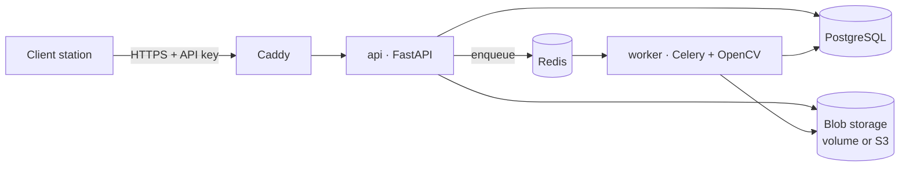
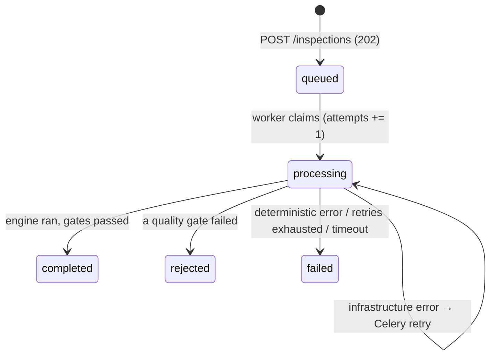
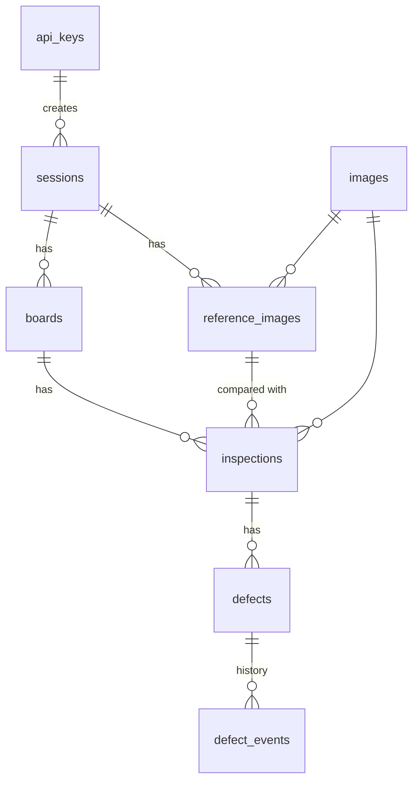

# Architecture

## Components



- **api** accepts uploads, stores them, enqueues work, serves results, crops and feedback endpoints.
  Endpoints are synchronous functions run in a thread pool; long-polling checks the database every 250 ms.
- **worker** runs `services.pipeline.run_inspection`: claim (row lock) → analyse → quality gates → save.
- **PostgreSQL** holds all metadata and feedback; **storage** holds photos, masks, aligned images, crops.
- **Redis** is only the Celery broker.

## Code layers

```
cli ─► api | worker ─► services ─► db | storage | queue ─► domain ─► engine
```

Enforced by import-linter. `engine` is pure (numpy in, dataclasses out); `domain` holds vocabulary, gates
and errors; `services` are the use cases and the only place that combines infrastructure.

## Inspection lifecycle



A newer inspection of the same board side marks older ones `superseded` (they stay in the database).

## Data model



Partial unique index `(session_id, side) WHERE is_active` guarantees one active reference per side.
`(api_key_id, idempotency_key)` is unique for idempotent submissions.

## Coordinate systems

| Frame | Where it is used |
|---|---|
| uploaded reference pixels | `bbox_ref`, mask polygon |
| uploaded test pixels | `bbox_test` |
| working pixels (reference resized to `work_width`) | inside the engine; aligned image, heatmap, crops |

`inspections.transform.ref_to_test` (3×3) maps uploaded-reference pixels to uploaded-test pixels
(homography ∘ ECC). Manual regions are mapped back with its inverse.

## Decisions

See [adr/](adr/).
